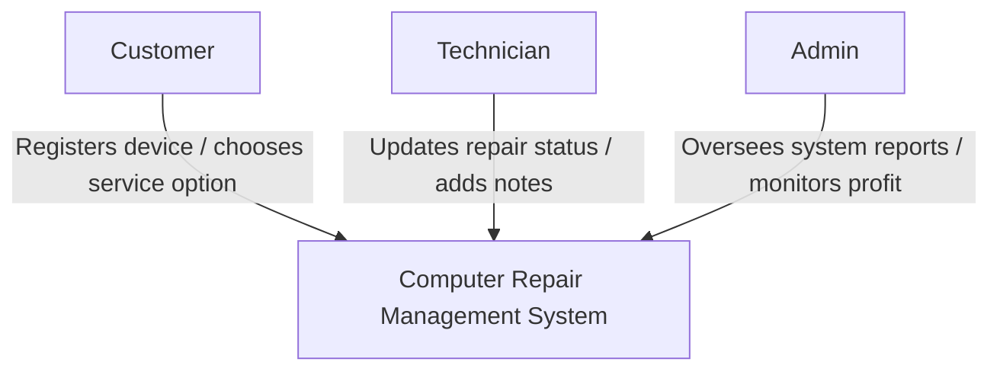
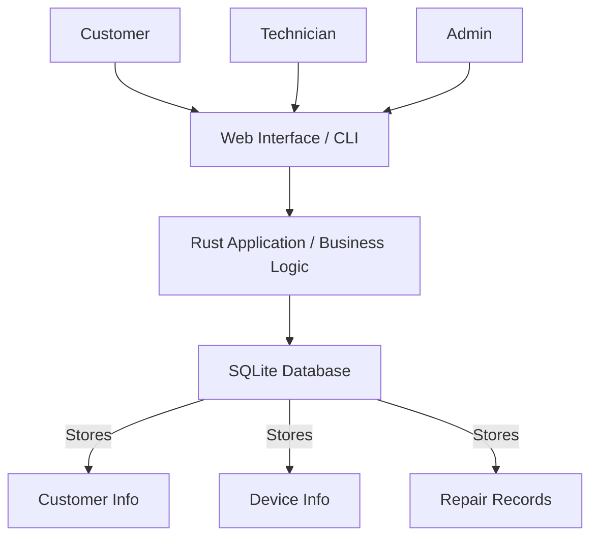
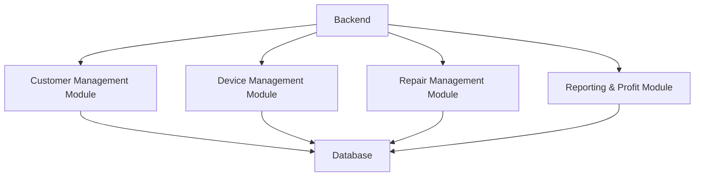
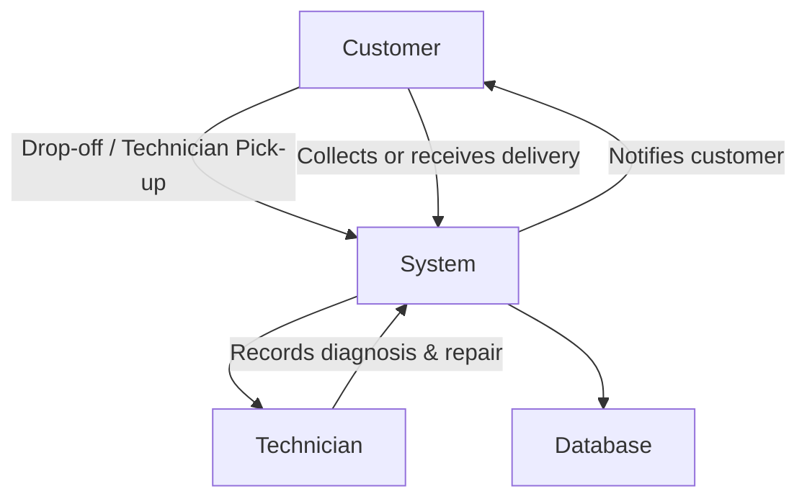

# System Architecture

## Project Title

Computer Repair Management System

## Domain

The system operates in the IT support and computer repair domain. It helps repair shops manage customer devices, track repairs, accessories, service options, and repair pricing.

## Problem Statement

Manual tracking of repair jobs leads to lost records, confusion with accessories, difficulty in tracking device repair status, and challenges in monitoring repair profit. This system provides a digital solution for repair shops to track devices efficiently from intake to completion.

## Individual Scope

The project will focus on core functionality: customer registration, device intake, repair tracking, accessory tracking, service options (pickup/drop-off/delivery), repair pricing, and profit calculation.

---

# C4 Diagrams

---

## Level 1: System Context

This shows **how the system interacts with users**.

**Explanation:**

* **Customer**: Brings or requests pickup/delivery of devices, selects service type.
* **Technician**: Records diagnosis, repair steps, device accessories, and status.
* **Admin**: Monitors system performance, profit, and overall workflow.
* **System**: Core application managing all repair jobs.

---

## Level 2: Container Diagram

This shows the **major components (containers) of the system** and how they interact.

**Explanation:**

* **Web Interface / CLI**: Where users interact with the system.
* **Backend**: Rust application that handles logic like repair tracking, accessory checks, service type, and profit calculation.
* **Database**: Stores all persistent data.

---

## Level 3: Component Diagram

This shows the **internal modules/components of the Rust application**.

**Explanation:**

* **Customer Management Module**: Registers customers, stores contact info.
* **Device Management Module**: Records sticker number, device accessories, problem description.
* **Repair Management Module**: Tracks repair status, internal/external repairs, technician notes.
* **Reporting & Profit Module**: Calculates profit, generates reports, monitors repair workflow.

---

## End-to-End Flow (for clarity)

**Explanation:**

* Shows **full workflow** from customer device intake to repair completion and collection/delivery.
