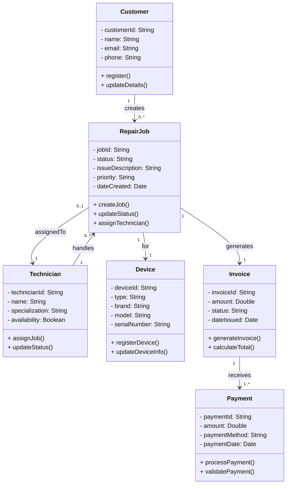

# Class Diagram

## Diagram

---

## Notes

- The diagram models a computer repair management system.
- Multiplicity shows relationships between entities.
- RepairJob is the central class connecting all system components.
- The model follows object-oriented design principles.

---

## Design Decisions

- RepairJob is the central entity because all system processes revolve around it.
- Customer and Technician are separated for clear role distinction.
- Device is independent to allow multiple devices per customer.
- Invoice is tied to RepairJob to ensure accurate billing.
- Payment is separated to allow flexible payment handling.
