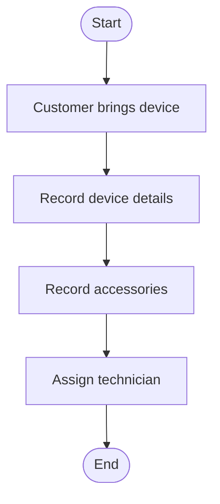
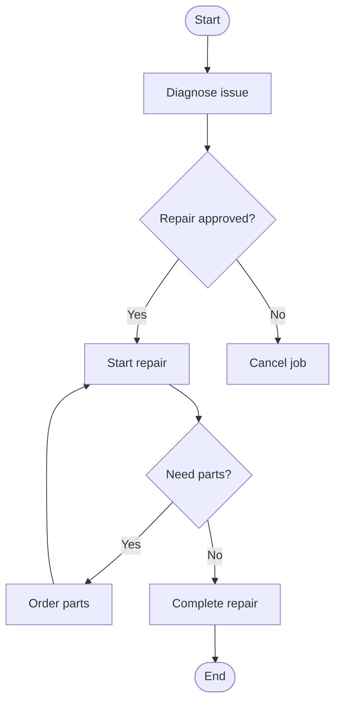
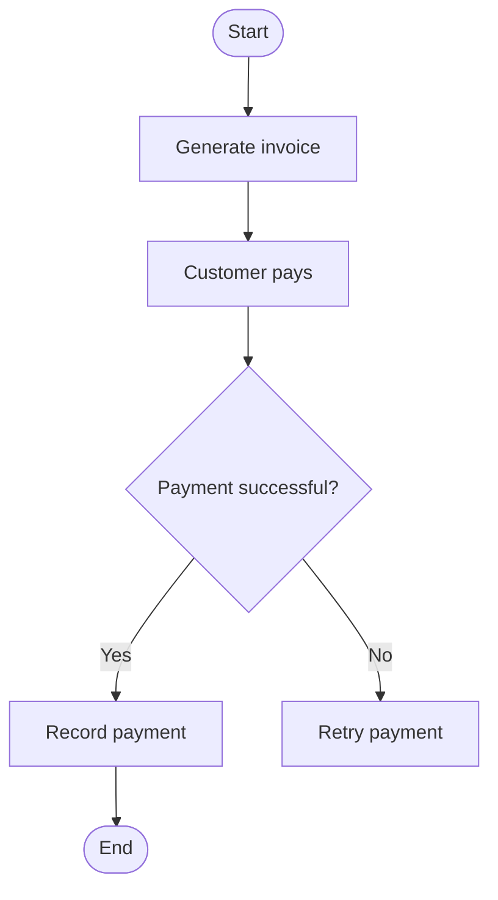
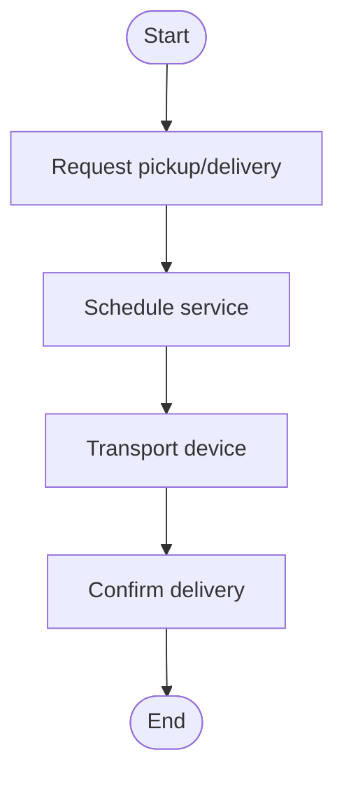
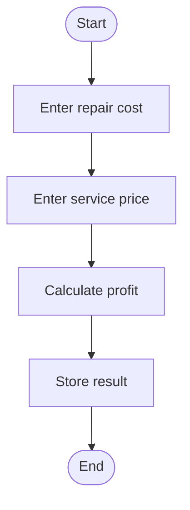
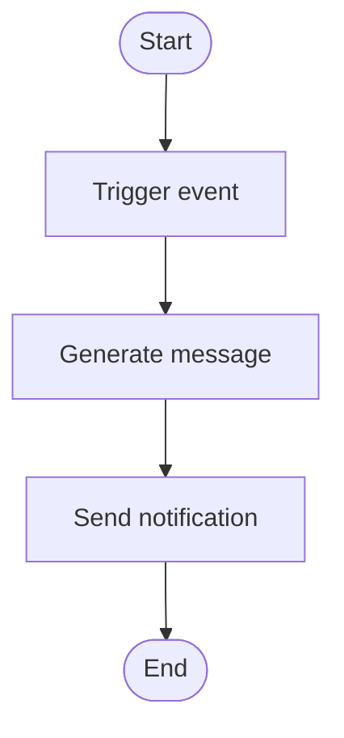
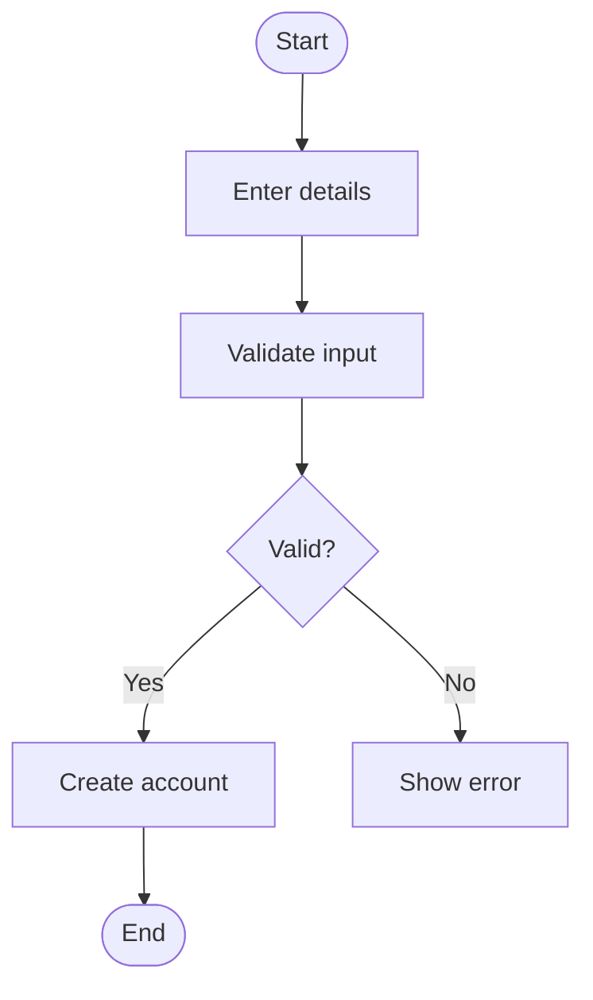
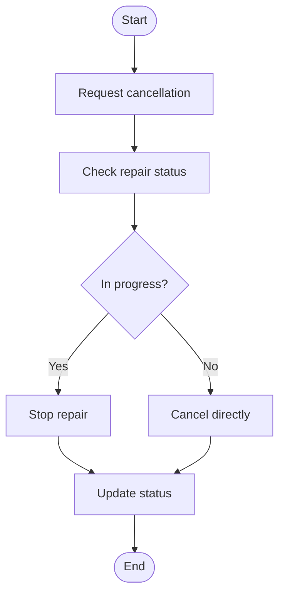

# Assignment 8: Activity Diagrams

## 1. Device Intake Workflow

### Explanation

* Ensures all device and accessory data is captured
* Addresses lost record problem

---

## 2. Repair Workflow

### Explanation

* Includes decision-making and looping
* Handles real repair scenarios

---

## 3. Payment Workflow

### Explanation

* Ensures reliable payment handling
* Supports profit tracking

---

## 4. Pickup/Delivery Workflow

---

## 5. Profit Calculation Workflow

---

## 6. Notification Workflow

---

## 7. Customer Registration Workflow

---

## 8. Cancel Repair Workflow

### Explanation

* Handles both early and late cancellations
* Improves system flexibility
