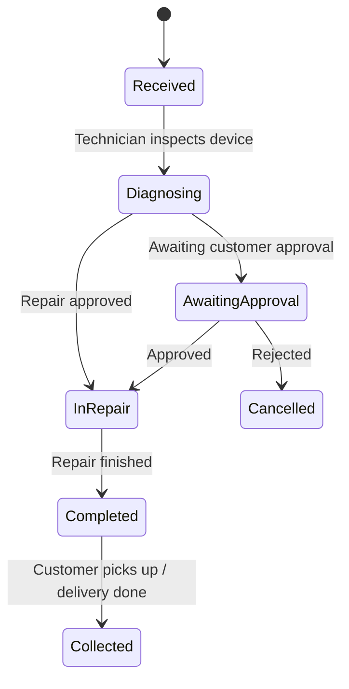
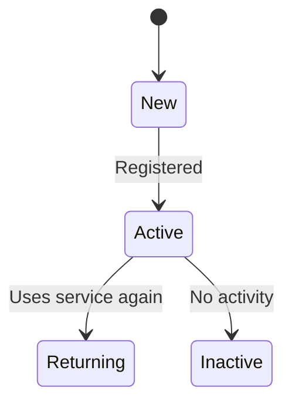
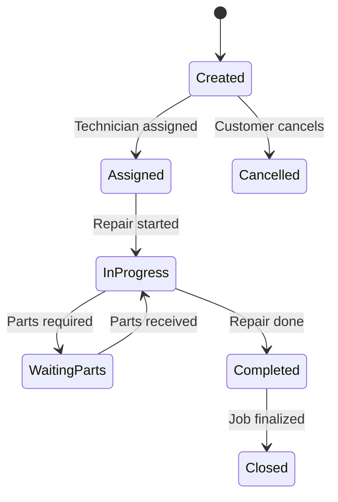
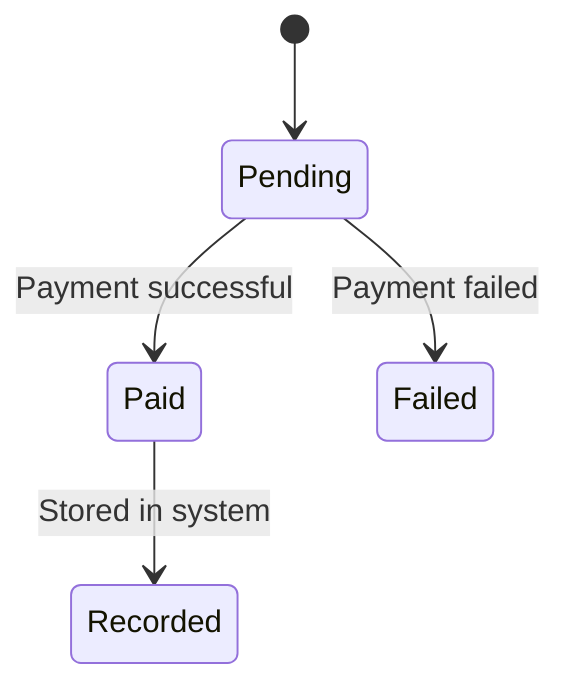
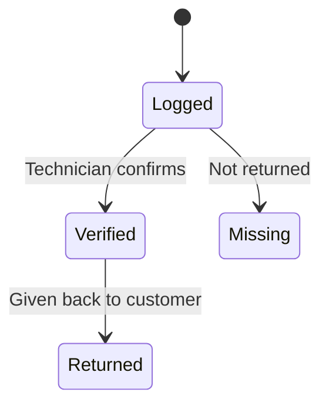
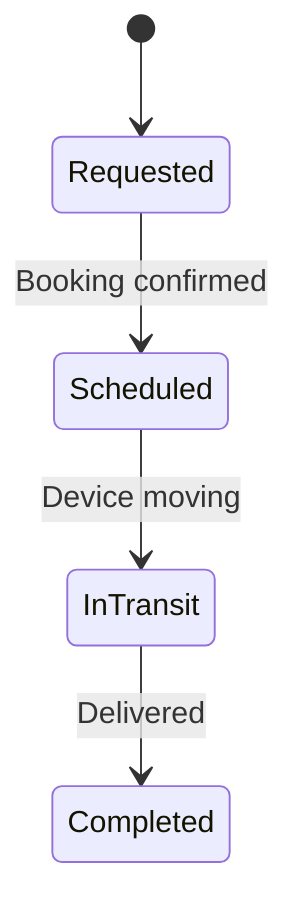
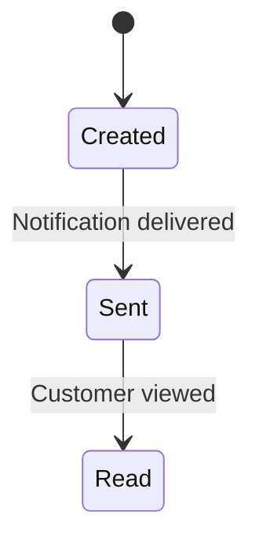
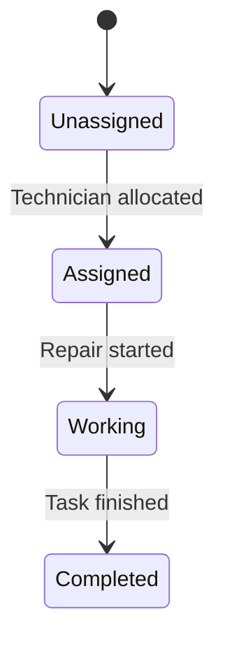

# Assignment 8: State Transition Diagrams

## 1. Device Lifecycle

### Explanation

* States: Received, Diagnosing, AwaitingApproval, InRepair, Completed, Collected, Cancelled
* Tracks full lifecycle of a device
* Maps to:

  * FR-002: Device intake recording
  * FR-004: Repair tracking
  * FR-006: Service handling

---

## 2. Customer Account

### Explanation

* Tracks customer engagement
* Maps to FR-001: Customer registration

---

## 3. Repair Job

### Explanation

* Tracks repair job progress
* Maps to FR-004: Repair tracking

---

## 4. Payment

### Explanation

* Tracks payment lifecycle
* Maps to FR-008: Pricing and profit calculation

---

## 5. Accessory Record

### Explanation

* Prevents accessory disputes
* Maps to FR-003: Accessory tracking

---

## 6. Service Request

### Explanation

* Tracks pickup/delivery service
* Maps to FR-006: Service handling options

---

## 7. Notification

### Explanation

* Keeps customers informed
* Supports system communication

---

## 8. Technician Assignment

### Explanation

* Tracks technician workload
* Supports repair workflow efficiency
